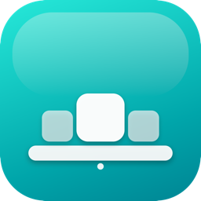
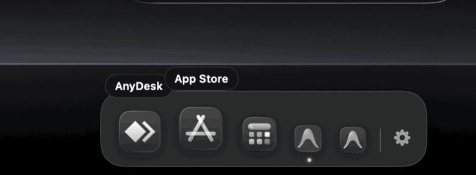
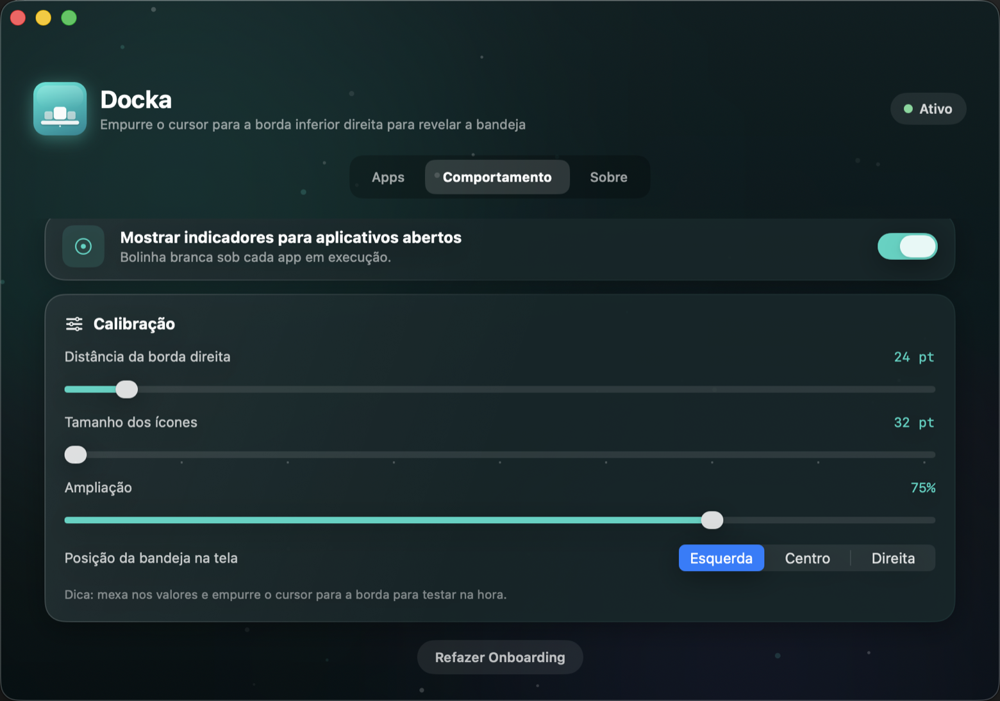

<p align="center">
  
</p>

<h1 align="center">Docka</h1>

<p align="center">
  <strong>Uma segunda bandeja de apps para o seu Mac — escondida na borda da tela, a um empurrão de cursor de distância.</strong><br>
  Leve, 100% SwiftUI e sem pedir nenhuma permissão do sistema.
</p>

<p align="center">
  <a href="https://github.com/editzffaleta/docka/releases/latest"></a>
  <a href="https://github.com/editzffaleta/docka/stargazers"></a>
  
  
  
  
  
  
</p>

<p align="center">
  
</p>

---

## O que é o Docka?

O **Docka** é uma bandeja de apps **gratuita e de código aberto** que fica invisível na borda inferior da tela. Empurre o cursor contra a borda e ela desliza para cima, em vidro translúcido, com os apps que você escolheu — magnificação de ícones, balão de nome, indicador de apps abertos e quique ao lançar. Solte o mouse e ela some.

Perfeita para quem mantém o Dock enxuto mas quer um segundo escalão de apps sempre à mão — sem poluir a tela, sem apps de barra de menus pesados.

**Sem dependências. Sem telemetria. Sem permissões de Acessibilidade. Só um empurrão de cursor.**

## Recursos

### A bandeja

| Recurso | Descrição |
|---------|-----------|
| **Revelação pela borda** | Encoste o cursor na borda inferior e a bandeja sobe com mola; afaste e ela se recolhe sozinha |
| **Magnificação de ícones** | Curva gaussiana como a do Dock — o ícone sob o cursor cresce até 1,75× a partir da linha de base e empurra os vizinhos |
| **Balão de nome** | O nome do app flutua em uma cápsula de vidro sobre o ícone ampliado |
| **Indicador de execução** | Bolinha branca sob cada app aberto |
| **Quique ao lançar** | O ícone quica duas vezes enquanto o app abre, com som opcional |
| **Vidro real** | `NSPanel` translúcido (`regularMaterial`) acima de qualquer janela, em todos os Spaces e apps em tela cheia |

### Interações

| Recurso | Descrição |
|---------|-----------|
| **Arrastar arquivos** | Solte arquivos do Finder sobre um ícone para abri-los com aquele app |
| **Reordenar** | Arraste um ícone sobre outro para trocar a ordem |
| **Clique-direito** | Menu com Abrir, Mostrar no Finder e Remover do Docka |
| **Atalho global ⌘⇧D** | Fixa a bandeja aberta (não some com o mouse) e esconde no segundo toque |
| **Multi-monitor** | A bandeja aparece na tela onde o cursor está |

### Modos e ajustes

| Recurso | Descrição |
|---------|-----------|
| **Pressure Zone** | Modo opcional que só revela a bandeja quando você empurra o cursor contra o canto de propósito — evita aberturas acidentais em apps de tela cheia |
| **Calibração ao vivo** | Distância da borda e tamanho dos ícones ajustáveis por slider, com efeito imediato na bandeja |
| **Onboarding em 3 passos** | Boas-vindas → escolha de apps (grade com busca) → modo de revelação |
| **Barra de menus** | Ícone com atalhos rápidos: sons, Pressure Zone, configurações e encerrar |

### O gerenciador

<p align="center">
  
</p>

Janela única com três abas: **Apps** (prévia da bandeja + grade de todos os apps
instalados com busca), **Comportamento** (ampliação, posição, indicadores, quique,
Pressure Zone, sons e calibração ao vivo) e **Sobre**.

## Arquitetura

```
Sources/Docka/
├── DockaApp.swift           — @main, MenuBarExtra, janela principal, atalho global
├── Models.swift             — DockaStore (estado + preferências), PinnedApp
├── TrayController.swift     — NSPanel da bandeja, magnificação, polling do cursor
├── HotKey.swift             — atalho global ⌘⇧D (Carbon, sem permissões)
├── OnboardingView.swift     — fluxo de boas-vindas em 3 passos
├── SettingsWindowView.swift — abas Apps / Comportamento / Sobre
├── Effects.swift            — glass cards, fundo aurora, partículas, botões
└── Assets/                  — logo (gerada por código em scripts/make_logo.swift)
```

### Tecnologias

| Camada | Tecnologia |
|--------|-----------|
| Linguagem | Swift 5.9, Swift Package executável (sem `.xcodeproj`) |
| Interface | SwiftUI puro + `NSPanel` (AppKit) para a janela flutuante |
| Detecção do cursor | Polling leve de `NSEvent.mouseLocation` a 20×/s — dispensa Acessibilidade |
| Magnificação | Curva gaussiana por distância do cursor (`exp(-d²/2σ²)`), mola interativa |
| Ícones | `NSWorkspace.shared.icon(forFile:)` em representação de 256 px |
| Atalho global | `RegisterEventHotKey` (Carbon) — funciona sem permissões |
| Arrastar e soltar | `Transferable` (`.draggable`/`.dropDestination`) com payload de URL |
| Persistência | `UserDefaults` + `@AppStorage` (caminhos dos apps e preferências) |

### Por que nenhuma permissão?

A maioria dos utilitários de borda de tela pede Acessibilidade ou Monitoramento de Entrada. O Docka evita as duas:

- A posição do cursor vem de **`NSEvent.mouseLocation`**, uma API pública que não exige permissão — lida por um timer leve, 20 vezes por segundo.
- O atalho global usa **Carbon `RegisterEventHotKey`**, o mecanismo clássico de hotkeys do macOS, também livre de permissões.
- A bandeja é um **`NSPanel` não-ativante**: aparece sobre qualquer app sem roubar o foco da janela em que você está trabalhando.

## Instalação

### DMG (recomendado)

Baixe o instalador na [página de releases](https://github.com/editzffaleta/docka/releases/latest),
abra o DMG e arraste o **Docka** para **Aplicativos**. Como o app não é notarizado,
no primeiro uso clique com o botão direito no ícone → **Abrir**.

### Compilar do código-fonte

Requisitos: macOS 14+ e as Command Line Tools do Xcode.

```bash
git clone https://github.com/editzffaleta/docka.git
cd docka
swift run
```

Na primeira execução, o onboarding abre para você escolher os apps.
Depois, empurre o cursor até a borda inferior direita da tela — ou pressione **⌘⇧D**. ✨

### Regenerar a logo e o demo

A logo é arte gerada por código, e o GIF de demonstração é capturado do app real
rodando em modo demo (`--demo` fixa a bandeja aberta com um hover simulado):

```bash
swift scripts/make_logo.swift                                # logo
.build/debug/Docka --demo &                                  # bandeja em modo demo
# capture frames com screencapture -R e depois:
swift scripts/make_gif.swift <pasta-dos-frames> assets/demo.gif
./scripts/make_dmg.sh 1.0.0                                  # Docka.app + instalador DMG
```

## Licença

MIT — veja [LICENSE](LICENSE).
