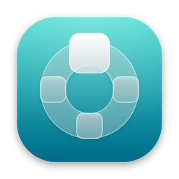
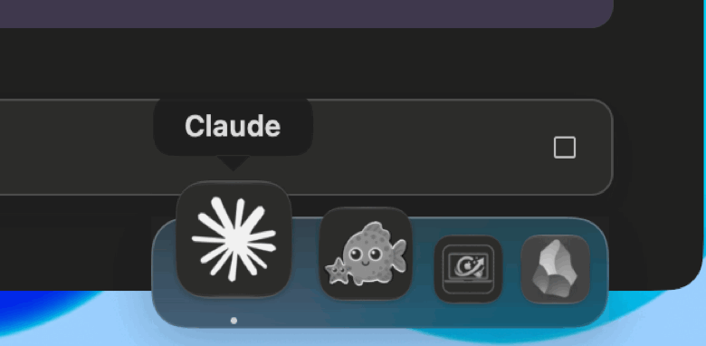
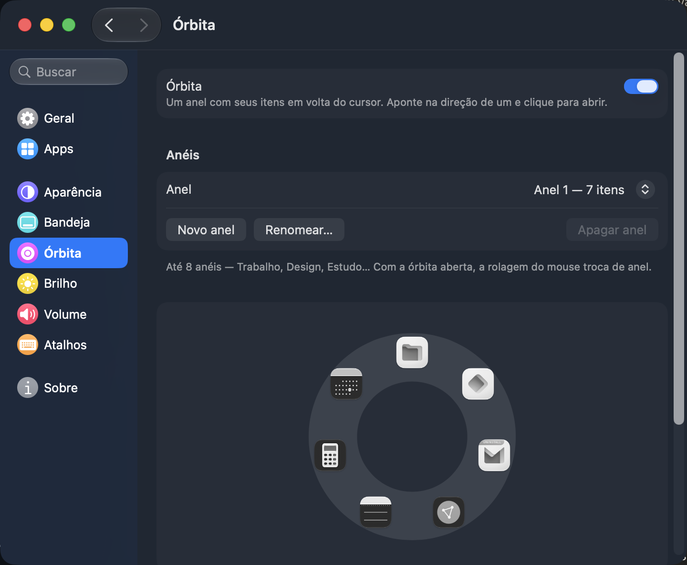

<p align="center">
  
</p>

<h1 align="center">Docka</h1>

<p align="center">
  <strong>Bandejas de apps, réguas de brilho e volume e uma órbita de lançamento — tudo escondido nas bordas da tela, a um empurrão de cursor de distância.</strong><br>
  Leve, 100% SwiftUI e sem pedir nenhuma permissão do sistema.
</p>

<p align="center">
  <a href="https://github.com/editzffaleta/docka/actions/workflows/ci.yml"></a>
  <a href="https://github.com/editzffaleta/docka/releases/latest"></a>
  <a href="https://github.com/editzffaleta/docka/stargazers"></a>
  
  
  
  
  
  
</p>

<p align="center">
  
</p>

---

## O que é o Docka?

O **Docka** é um conjunto de superfícies de borda **gratuito e de código aberto**: bandejas de apps que ficam invisíveis nas bordas que você escolher (inferior e laterais), réguas de brilho e volume, e a **Órbita** — um anel de lançamento que abre em volta do cursor. Empurre o cursor contra a borda e a superfície desliza para fora, em vidro translúcido; solte e ela some.

Perfeito para quem mantém o Dock enxuto mas quer um segundo escalão de apps, sites e pastas sempre à mão — sem poluir a tela, sem apps de barra de menus pesados.

**Sem dependências. Sem telemetria. Sem permissões de Acessibilidade. Só um empurrão de cursor.**

## Recursos

### A bandeja

| Recurso | Descrição |
|---------|-----------|
| **Revelação pela borda** | Encoste o cursor na borda da bandeja e ela desliza para fora com mola; afaste e ela se recolhe sozinha |
| **Várias bandejas** | Quantas quiser, na borda inferior ou nas laterais, cada uma com posição, alinhamento e apps próprios |
| **Magnificação de ícones** | A curva do Dock, parametrizada como no [dockbar](https://github.com/CatsJuice/dockbar): `size`, `gap`, `padding`, `maxScale` e `maxRange`. O ícone sob o cursor cresce (1,5× por padrão, ajustável) a partir da linha de base e empurra os vizinhos; fora do alcance, ninguém se mexe |
| **Balão de nome** | O nome do app flutua em uma cápsula de vidro sobre o ícone ampliado |
| **Indicador de execução** | Bolinha branca sob cada app aberto |
| **Quique ao lançar** | O ícone quica duas vezes enquanto o app abre, com som opcional |
| **Vidro real** | Vibrância do sistema com amostragem **atrás da janela** — a mesma do Dock — num `NSPanel` acima de qualquer app, em todos os Spaces e em tela cheia |

### Interações

| Recurso | Descrição |
|---------|-----------|
| **Arrastar arquivos** | Solte arquivos do Finder sobre um ícone para abri-los com aquele app |
| **Reordenar** | Arraste um ícone sobre outro para trocar a ordem |
| **Clique-direito** | Menu com Abrir, Mostrar no Finder, **Encerrar** (para app aberto, como no Dock) e Remover |
| **Atalhos globais** | Uma combinação para cada bandeja, para o brilho, para o volume e para abrir os ajustes — todas configuráveis, e o ⇧⌘D de sempre continua sendo o da primeira bandeja. O atalho fixa o painel aberto (não some com o mouse) e o esconde no segundo toque |
| **Multi-monitor** | A bandeja aparece na tela onde o cursor está |

### Órbita

Um anel com seus apps em volta do cursor. Aponte na direção de um e clique — não é preciso acertar o ícone, a direção basta.

| Recurso | Descrição |
|---------|-----------|
| **Aponte e solte** | O item do setor para onde o cursor aponta cresce e mostra o nome no miolo; o clique abre. Vale a direção, não a distância |
| **Zona morta no centro** | O buraco do anel não seleciona nada, então ele nunca nasce com um app já escolhido debaixo do cursor |
| **Quatro tipos de item** | App, site, arquivo e pasta — cada um abre do jeito próprio: app lança, site vai ao navegador, arquivo abre no app padrão, pasta abre no Finder |
| **Logo do site** | Ao adicionar um site, a logo vem do próprio site (favicon/apple-touch-icon), com prévia na hora — é a única conexão de saída do app, e nunca passa por serviço de terceiros |
| **Até 8 anéis** | Anéis nomeados (Trabalho, Design, Estudo…), cada um com seus itens. Com a órbita aberta, a rolagem do mouse troca de anel — o nome do ativo aparece no miolo; cada anel pode ter o próprio atalho global, que abre direto nele |
| **Reordenar no editor** | Selecione a zona e mova o item de casa em casa, no sentido horário ou anti-horário |
| **Editor visual** | Nos ajustes o anel aparece como ele é: clique num item para ver e editar a zona dele |
| **Botão lateral do mouse** | Um dos botões extras abre o anel. Aperte para abrir; segure, aponte e solte para lançar de uma vez |
| **Abre pela quina ou pelo atalho** | Cravar o cursor na quina escolhida abre o anel ali; o atalho global abre onde o cursor estiver. Esc fecha |

> O botão do mouse é **observado, não interceptado** — interceptar exigiria Monitoramento de Entrada. Ou seja, o clique continua chegando no app embaixo do cursor: num navegador, o botão lateral vai voltar uma página junto. Escolha um botão que você não use para outra coisa.
>
> Apps parecidos abrem o anel com um gesto de mouse em qualquer ponto da tela. Isso exige a permissão de **Monitoramento de Entrada**, e o Docka não pede permissão nenhuma — daí a quina e o atalho, que a leitura de posição do cursor e o Carbon já permitem sem pedir nada.

### Controles de borda

Réguas verticais que vivem numa lateral da tela e aparecem do mesmo jeito que a bandeja — encostando o cursor na borda. Não são itens da bandeja: cada uma tem painel próprio.

| Recurso | Descrição |
|---------|-----------|
| **Brilho da tela** | Régua com traços e um botão-sol que corre junto com o nível. Arraste o botão ou a régua; o valor é lido da tela de verdade, não estimado |
| **Volume da saída** | A mesma régua para o áudio, pelo CoreAudio — API pública, sem permissão. O ícone acompanha o nível como no menu de som, zero silencia de fato e subir a régua tira do mudo |
| **Onde ficam** | Lateral esquerda ou direita, alinhadas ao topo, ao centro ou à base. Só laterais: a régua é vertical, e deitada na borda inferior viraria outra coisa |
| **Convivência** | Postos na mesma lateral e na mesma posição, o volume se acomoda ao lado do brilho em vez de cobri-lo |

> O controle de brilho depende de uma API do sistema não documentada — a única forma de ler o brilho em Apple Silicon sem pedir Acessibilidade. Se uma atualização do macOS removê-la, o Docka esconde o controle em vez de fingir que funciona. O de volume não tem esse risco.

### Modos e ajustes

| Recurso | Descrição |
|---------|-----------|
| **Abrir no login** | O Docka sobe sozinho quando você entra no Mac, via `SMAppService` — sem helper, sem permissão, e você pode desligar direto nas Configurações do Sistema |
| **Vive na barra de menus** | Sem ícone no Dock e fora do ⌘Tab; a janela de configurações aparece só quando você pede |
| **Pressure Zone** | Modo opcional que só revela a bandeja quando você empurra o cursor contra o canto de propósito — evita aberturas acidentais em apps de tela cheia |
| **Calibração ao vivo** | Distância da borda e tamanho dos ícones ajustáveis por slider, com efeito imediato na bandeja |
| **Atalhos por ação** | Grave as combinações na aba Atalhos — uma por bandeja, brilho, volume, órbita e cada anel; conflito entre ações do Docka é apontado pelo nome |
| **Acessibilidade** | Respeita **Reduzir Movimento** do sistema (sem partículas, sem deslize, sem quique) e rotula a bandeja para o VoiceOver |
| **Onboarding em 3 passos** | Boas-vindas → escolha de apps (grade com busca) → modo de revelação |
| **Barra de menus** | Ícone com atalhos rápidos: sons, Pressure Zone, abrir no login, configurações e encerrar |

### O gerenciador

<p align="center">
  
</p>

No formato dos **Ajustes do Sistema**: barra lateral com busca e navegação com
histórico, e uma seção por assunto — **Geral**, **Apps**, **Aparência** (Tom e
material do painel com prévia simulada), **Bandeja**, **Órbita** (com o editor
visual do anel), **Brilho**, **Volume**, **Atalhos** e **Sobre**.

## Arquitetura

```
Sources/DockaCore/           — lógica pura, sem SwiftUI e sem AppKit (é o que os testes cobrem)
├── TrayGeometry.swift       — onde cada bandeja fica e quando revelar/esconder
├── Magnification.swift      — a curva de ampliação do Dock e a ancoragem no cursor
├── DockConfig.swift         — bandejas múltiplas: borda, alinhamento e apps
├── Orbita.swift             — geometria do anel: setores, zona morta, quina
├── AnelDaOrbita.swift       — anéis nomeados e itens (app, site, arquivo, pasta)
├── Deslizante.swift         — a matemática comum das réguas de brilho e volume
├── Favicon.swift            — onde procurar a logo de um site (só no próprio site)
├── AcaoDeAtalho.swift       — uma combinação por ação, com limpeza de órfãos
├── Shortcut.swift           — atalho global: validação e exibição
└── AppScanner.swift         — varredura de /Applications, nome do app, reordenação

Sources/Docka/               — a casca: SwiftUI, AppKit e o ciclo de vida
├── DockaApp.swift           — @main, MenuBarExtra, janela de ajustes, abrir no login
├── Models.swift             — DockaStore (estado + preferências) e migrações
├── TrayController.swift     — NSPanels das bandejas, polling do cursor, despacho de atalhos
├── OrbitaController.swift   — o anel no cursor: seleção por direção, rolagem entre anéis
├── DeslizanteController.swift — as réguas de brilho e volume nas laterais
├── BrightnessBackend.swift  — DisplayServices: ler/escrever o brilho da tela sob o cursor
├── VolumeBackend.swift      — CoreAudio: volume e mudo da saída padrão
├── FaviconStore.swift       — a logo do site, baixada do próprio site e cacheada
├── ArrastoAppKit.swift      — arrasto e clique que funcionam em painel não-ativante
├── HotKey.swift             — atalhos globais (Carbon, sem permissões)
├── OnboardingView.swift     — fluxo de boas-vindas em 3 passos
├── SettingsWindowView.swift — o gerenciador no formato dos Ajustes do Sistema
└── Assets/                  — logo (renderizada por scripts/render_logo.swift)

Tests/DockaCoreTests/        — swift-testing (@Test/#expect)
```

A separação existe por um motivo prático: geometria de tela e varredura de disco
são exatamente as partes que quebram sem avisar, e nenhuma delas precisa de uma
janela para ser exercitada. O `TrayController` cuida do `NSPanel`; as contas
moram no `DockaCore`, onde `swift test` alcança.

### Tecnologias

| Camada | Tecnologia |
|--------|-----------|
| Linguagem | Swift 5.9, Swift Package executável (sem `.xcodeproj`) |
| Interface | SwiftUI puro + `NSPanel` (AppKit) para a janela flutuante |
| Detecção do cursor | Polling leve de `NSEvent.mouseLocation` a 20×/s — dispensa Acessibilidade |
| Magnificação | Onda de cosseno entre `1` e `maxScale`, limitada por `maxRange`, avaliada como a inclinação média de um seno ao longo da largura do ícone — modelo do [dockbar](https://github.com/CatsJuice/dockbar). Mola interativa por cima |
| Ícones | `NSWorkspace.shared.icon(forFile:)` em representação de 256 px |
| Atalhos globais | `RegisterEventHotKey` (Carbon), um registro por ação — sem permissões; gravação por monitor **local** de eventos |
| Brilho | `DisplayServices` (privado, resolvido em runtime): a única forma de LER o brilho em Apple Silicon sem Acessibilidade — na tela sob o cursor |
| Volume | CoreAudio (API pública): volume virtual e mudo da saída padrão, acompanhando troca de fone |
| Logo de site | `URLSession` efêmera contra o próprio site (favicon/apple-touch-icon) — a única conexão de saída do app |
| Acessibilidade | `accessibilityReduceMotion` do sistema + rótulos e valores de VoiceOver |
| Arrastar e soltar | `Transferable` (`.draggable`/`.dropDestination`) com payload de URL |
| Persistência | `UserDefaults` publicado via `@Published` (caminhos dos apps e preferências) |
| Abrir no login | `SMAppService.mainApp` — sem helper e sem permissão |
| Testes | swift-testing (`@Test`/`#expect`) sobre o alvo `DockaCore` |

### Por que nenhuma permissão?

A maioria dos utilitários de borda de tela pede Acessibilidade ou Monitoramento de Entrada. O Docka evita as duas:

- A posição do cursor vem de **`NSEvent.mouseLocation`**, uma API pública que não exige permissão — lida por um timer leve, 20 vezes por segundo.
- O atalho global usa **Carbon `RegisterEventHotKey`**, o mecanismo clássico de hotkeys do macOS, também livre de permissões.
- A bandeja é um **`NSPanel` não-ativante**: aparece sobre qualquer app sem roubar o foco da janela em que você está trabalhando.

## Instalação

### DMG (recomendado)

Baixe o instalador na [página de releases](https://github.com/editzffaleta/docka/releases/latest),
abra o DMG e arraste o **Docka** para **Aplicativos**. Como o app não é notarizado,
no primeiro uso clique com o botão direito no ícone → **Abrir**.

### Compilar do código-fonte

Requisitos: macOS 14+ e as Command Line Tools do Xcode.

```bash
git clone https://github.com/editzffaleta/docka.git
cd docka
swift test   # opcional: 160+ testes do DockaCore
swift run
```

Na primeira execução, o onboarding abre para você escolher os apps.
Depois, empurre o cursor até a borda configurada — ou pressione **⇧⌘D**. ✨

### Regenerar a logo e o demo

A logo é arte gerada por código, e o GIF de demonstração é capturado do app real
rodando em modo demo (`--demo` fixa a bandeja aberta com um hover simulado):

```bash
swift scripts/render_logo.swift Sources/Docka/Assets/logo.png A   # logo (variante A = teal, B = noturna)
.build/debug/Docka --demo &                                       # bandeja em modo demo
# capture frames com screencapture -R e depois:
swift scripts/make_gif.swift <pasta-dos-frames> assets/demo.gif
./scripts/make_dmg.sh 1.1.0                                       # Docka.app + instalador DMG
```

O `make_dmg.sh` também sabe assinar e notarizar: com uma conta Apple Developer,
exporte `DOCKA_SIGN_ID` (identidade Developer ID) e `DOCKA_NOTARY_PROFILE`
(perfil do `notarytool`) antes de rodar e o DMG sai notarizado e grampeado —
sem nenhum aviso do Gatekeeper. Sem as variáveis, o script usa assinatura
ad-hoc, e o primeiro uso pede clique-direito → Abrir.

## Comunidade

- **[Contribuindo](CONTRIBUTING.md)** — como preparar o ambiente, princípios do
  projeto (zero dependências, zero permissões), estilo de código e processo de PR
- **[Política de Segurança](SECURITY.md)** — como reportar vulnerabilidades em
  privado, prazos de resposta e o modelo de segurança do app
- **[Registro de mudanças](CHANGELOG.md)** — o que entrou em cada versão
- **[Issues](https://github.com/editzffaleta/docka/issues)** — bugs e ideias

## Licença

MIT — veja [LICENSE](LICENSE).
