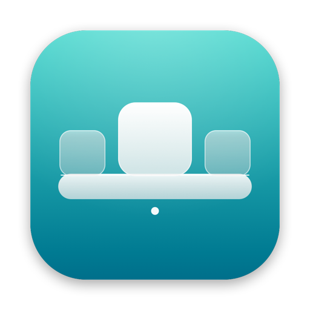
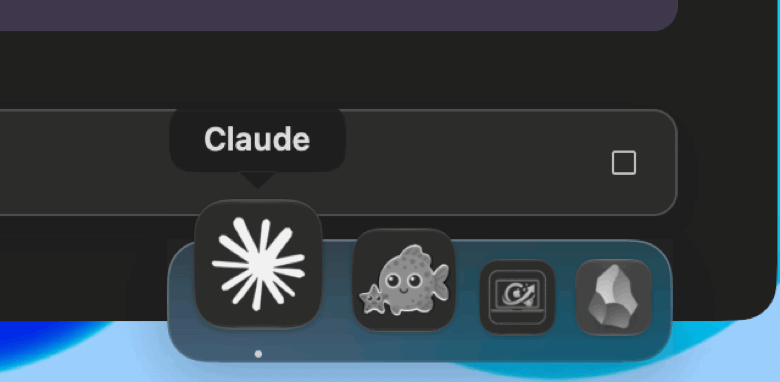
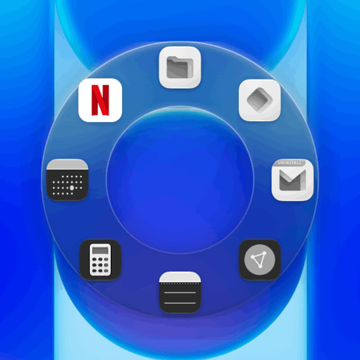
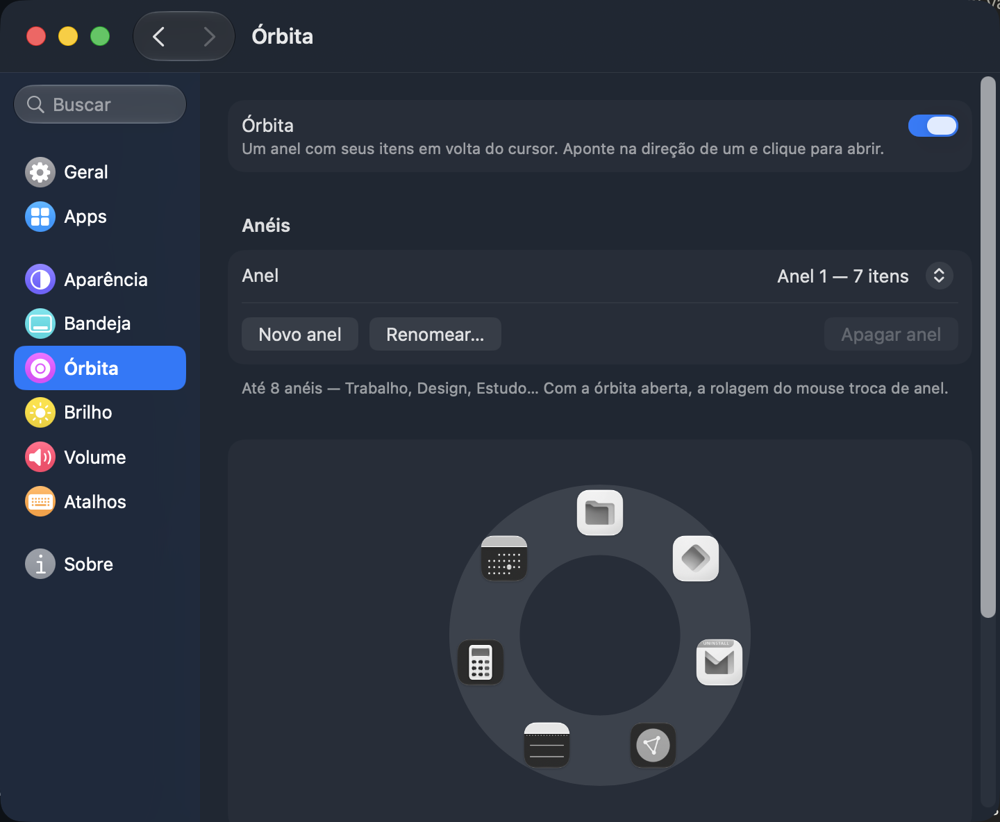

<p align="center">
  
</p>

<h1 align="center">Docka</h1>

<p align="center">
  <strong>Bandejas de apps, réguas de brilho e volume e uma órbita de lançamento — tudo escondido nas bordas da tela, a um empurrão de cursor de distância.</strong><br>
  Leve, 100% SwiftUI, com um núcleo que não pede nenhuma permissão — e módulos opcionais que só pedem quando você liga.
</p>

<p align="center">
  <a href="https://github.com/editzffaleta/docka/actions/workflows/ci.yml"></a>
  <a href="https://github.com/editzffaleta/docka/releases/latest"></a>
  <a href="https://github.com/editzffaleta/docka/stargazers"></a>
  
  
  
  
  
  
</p>

<p align="center">
  
</p>

---

## O que é o Docka?

O **Docka** é um conjunto de superfícies de borda **gratuito e de código aberto**: bandejas de apps que ficam invisíveis nas bordas que você escolher (inferior e laterais), réguas de brilho e volume, e a **Órbita** — um anel de lançamento que abre em volta do cursor. Empurre o cursor contra a borda e a superfície desliza para fora, em vidro translúcido; solte e ela some.

Perfeito para quem mantém o Dock enxuto mas quer um segundo escalão de apps, sites e pastas sempre à mão — sem poluir a tela, sem apps de barra de menus pesados.

**Sem dependências. Sem telemetria. Núcleo sem permissões. Só um empurrão de cursor.**

## Recursos

### A bandeja

| Recurso | Descrição |
|---------|-----------|
| **Revelação pela borda** | Encoste o cursor na borda da bandeja e ela desliza para fora com mola; afaste e ela se recolhe sozinha |
| **Várias bandejas** | Quantas quiser, na borda inferior ou nas laterais, cada uma com posição, alinhamento e apps próprios |
| **Magnificação de ícones** | A curva do Dock, parametrizada como no [dockbar](https://github.com/CatsJuice/dockbar): `size`, `gap`, `padding`, `maxScale` e `maxRange`. O ícone sob o cursor cresce (1,5× por padrão, ajustável) a partir da linha de base e empurra os vizinhos; fora do alcance, ninguém se mexe |
| **Balão de nome** | O nome do app flutua em uma cápsula de vidro sobre o ícone ampliado |
| **Indicador de execução** | Bolinha branca sob cada app aberto |
| **Quique ao lançar** | O ícone quica duas vezes enquanto o app abre, com som opcional |
| **Vidro real** | Vibrância do sistema com amostragem **atrás da janela** — a mesma do Dock — num `NSPanel` acima de qualquer app, em todos os Spaces e em tela cheia |

### Interações

| Recurso | Descrição |
|---------|-----------|
| **Arrastar arquivos** | Solte arquivos do Finder sobre um ícone para abri-los com aquele app |
| **Reordenar** | Arraste um ícone sobre outro para trocar a ordem |
| **Clique-direito** | Menu com Abrir, Mostrar no Finder, **Encerrar** (para app aberto, como no Dock) e Remover |
| **Atalhos globais** | Uma combinação para cada bandeja, para o brilho, para o volume e para abrir os ajustes — todas configuráveis, e o ⇧⌘D de sempre continua sendo o da primeira bandeja. O atalho fixa o painel aberto (não some com o mouse) e o esconde no segundo toque |
| **Multi-monitor** | A bandeja aparece na tela onde o cursor está |

### Órbita

Um anel com seus itens em volta do cursor. Aponte na direção de um e clique — não é preciso acertar o ícone, a direção basta.

<p align="center">
  
</p>

| Recurso | Descrição |
|---------|-----------|
| **Aponte e solte** | O item do setor para onde o cursor aponta cresce e mostra o nome no miolo; o clique abre. Vale a direção, não a distância |
| **Zona morta no centro** | O buraco do anel não seleciona nada, então ele nunca nasce com um app já escolhido debaixo do cursor |
| **Seis tipos de item** | App, site, arquivo e pasta — cada um abre do jeito próprio: app lança, site vai ao navegador, arquivo abre no app padrão, pasta abre no Finder. Mais **submenu**, que abre outro anel no mesmo lugar, e **ação rápida** (travar a tela, ejetar discos…) |
| **Submenus** | Um item pode abrir outro anel sem trocar o ativo; o miolo mostra "‹ nome" e clicar nele (ou Esc) volta um nível |
| **Logo do site** | Ao adicionar um site, a logo vem do próprio site (favicon/apple-touch-icon), com prévia na hora — é a única conexão de saída do app, e nunca passa por serviço de terceiros |
| **Até 8 anéis** | Anéis nomeados (Trabalho, Design, Estudo…), cada um com seus itens. Com a órbita aberta, a rolagem do mouse troca de anel — o nome do ativo aparece no miolo; cada anel pode ter o próprio atalho global, que abre direto nele |
| **Reordenar no editor** | Selecione a zona e mova o item de casa em casa, no sentido horário ou anti-horário |
| **Editor visual** | Nos ajustes o anel aparece como ele é: clique num item para ver e editar a zona dele |
| **Botão lateral do mouse** | Um dos botões extras abre o anel. Aperte para abrir; segure, aponte e solte para lançar de uma vez |
| **Abre pela quina ou pelo atalho** | Cravar o cursor na quina escolhida abre o anel ali; o atalho global abre onde o cursor estiver. Esc fecha |

> O botão do mouse é **observado, não interceptado** — interceptar exigiria Monitoramento de Entrada. Ou seja, o clique continua chegando no app embaixo do cursor: num navegador, o botão lateral vai voltar uma página junto. Escolha um botão que você não use para outra coisa.
>
> Apps parecidos abrem o anel com um gesto de mouse em qualquer ponto da tela. Isso exige a permissão de **Monitoramento de Entrada**, e o Docka não pede permissão nenhuma — daí a quina e o atalho, que a leitura de posição do cursor e o Carbon já permitem sem pedir nada.

### Prateleira

Um painel numa lateral para estacionar o que você está arrastando e soltar
depois onde quiser — como deixar um papel na mesa enquanto troca de pasta.

| Recurso | Descrição |
|---------|-----------|
| **Abre ao arrastar** | Comece a arrastar qualquer coisa, em qualquer app, e a prateleira aparece na lateral. Também abre encostando na borda ou pelo atalho |
| **Arquivos, textos e links** | Cada item é guardado na forma mais específica: um arquivo do Finder vira arquivo (não o texto de dentro dele), um endereço web vira link |
| **Devolver** | Clique abre (texto é copiado); arraste um item para levá-lo, ou a alça **Tudo** para levar todos de uma vez (havendo arquivos, ela leva só os arquivos: o Finder recusa a soltura inteira quando eles vêm misturados com texto) |
| **Só referências** | A prateleira não copia nada. Um arquivo movido para outra pasta a partir dela, ou apagado, some da lista sozinho |
| **Limite** | Até 40 itens, guardados entre aberturas do Docka; os mais antigos saem primeiro |

> Perceber que um arrasto começou sem Monitoramento de Entrada: o macOS escreve o que está sendo arrastado numa área de transferência própria, e o contador dela muda a cada arrasto. O Docka lê esse contador junto com a posição do cursor — leitura pura, nada é interceptado.

### Bloco de notas

Notas rápidas numa lateral, para anotar sem abrir app nem trocar de janela.

| Recurso | Descrição |
|---------|-----------|
| **Digita sem roubar o foco** | O bloco recebe o teclado como o Spotlight: o app em que você estava continua o ativo. Enquanto você escreve ele não some, mesmo com o cursor longe; Esc devolve o teclado |
| **Abas** | Até 12 notas; o nome de cada aba é a primeira linha da nota — quem escreve "# Compras" já deu nome a ela |
| **Salva sozinho** | Meio segundo depois da última tecla, num arquivo próprio em `~/Library/Application Support/Docka/notas.json` |
| **Markdown** | Pré-visualização com títulos, listas, citações, código e tarefas (`- [ ]`) que se marcam com um clique |
| **Atalho** | Abre já pronto para digitar; o segundo toque esconde. Também abre encostando na borda |
| **Exportar** | Copia a nota ou salva como `.md` |

### Monitor do sistema

| Recurso | Descrição |
|---------|-----------|
| **Painel de borda** | CPU, memória e rede com gráfico dos últimos dois minutos; disco livre e bateria (com tempo restante); aviso quando o Mac esquenta |
| **Na barra de menus** | Uma leitura opcional ao lado do ícone: CPU, memória, download ou bateria |
| **Parado não gasta** | As medições só rodam com o painel aberto ou com leitura na barra |
| **Alertas** | Aviso no canto da tela para CPU alta por minutos seguidos, memória apertada, disco quase cheio, bateria baixa e Mac esquentando — com limites ajustáveis, uma vez por ocorrência. É um cartão do próprio Docka: notificações do sistema pediriam autorização |
| **Números de verdade** | CPU pelo intervalo (não a média desde o boot), memória como o Monitor de Atividade conta, rede só das interfaces físicas — a VPN não conta em dobro |

> Tudo por API pública e sem permissão: Mach (`host_processor_info`, `host_statistics64`) para CPU e memória, IOKit (`IOPowerSources`) para bateria, `getifaddrs` para rede e o `FileManager` para disco.

### Área de transferência

| Recurso | Descrição |
|---------|-----------|
| **Gatilhos** *(módulo opcional)* | Digitar o gatilho de um snippet (como `;hoje`) em qualquer app troca ele pelo texto |
| **Snippets** | Textos prontos com variáveis (`{data}`, `{hora}`, `{dia}`, `{clipboard}`), escolhidos num painel com busca. Com o "Colar sozinho", entram direto no app da frente e o que estava copiado antes volta |
| **Colar sozinho** *(módulo opcional, Acessibilidade)* | Escolher no histórico ou num snippet cola direto, em vez de só copiar |
| **Histórico** | Textos, links e arquivos copiados, com busca, fixar no topo e navegação pelo teclado (↑↓ e ↩). Escolher devolve o item à área de transferência, pronto para ⌘V |
| **Senhas ficam de fora** | O que gerenciadores de senha marcam como sigiloso (convenção nspasteboard.org) nunca entra no histórico |
| **Colar sem formatação** | Deixa o que está copiado em texto puro — sem negrito, cor nem fonte |
| **Limpar links** | Tira `utm_`, `fbclid`, `gclid` e outros rastreadores, manualmente ou a cada cópia |
| **Apagar depois de um tempo** | Esvazia a área de transferência após 1 min a 1 h, ou ao travar a tela ou dormir; o histórico continua com o item |

> Ler a área de transferência não pede permissão: o Docka olha só o contador de mudanças, a cada meio segundo, e lê o conteúdo quando ele muda. Colar sozinho no app da frente pediria Acessibilidade — por isso, aqui, escolher um item só o deixa pronto para o seu ⌘V.

### Janelas

| Recurso | Descrição |
|---------|-----------|
| **Encaixar** *(Acessibilidade)* | Metades, quartos, terços, maximizar e centralizar — por atalho (um por layout) ou pelo menu Janelas na barra |
| **Ciclo de larguras** | Repetir o atalho de uma metade alterna entre ½, ⅓ e ⅔ da tela |
| **Outra tela** | Leva a janela para a próxima tela mantendo a proporção: a metade esquerda de uma vira a metade esquerda da outra |
| **Voltar** | Devolve a janela ao tamanho e lugar de antes do primeiro encaixe |
| **Arrastar até a borda** | Leve a janela até a borda: laterais dão metades, cantos dão quartos, o topo maximiza — com prévia de onde ela vai parar |
| **Alternador de apps** | Num atalho próprio (sugestão ⌥Tab): apps na ordem de uso, segure e aperte para avançar, solte para trocar. Sem permissão; com Acessibilidade, uma entrada por janela; com Gravação de Tela, miniaturas das janelas. Não substitui o ⌘Tab |

### Mouse *(módulo opcional, Acessibilidade)*

| Recurso | Descrição |
|---------|-----------|
| **Inverter só o mouse** | Vertical e horizontal separados; o trackpad e o Magic Mouse ficam como o sistema manda |
| **Rolagem linear** | Cada dente da roda rola sempre 1, 3, 5 ou 10 linhas, por mais rápido que se gire |
| **Rolagem suave** | Cada dente vira um deslize curto com desaceleração; dentes seguidos se somam |
| **Rolar de lado** | Segurando ⌥, ⌃ ou ⌘, a roda rola na horizontal |
| **Botões laterais** | Voltam e avançam no Finder, Safari, Chrome e outros (⌘[ / ⌘]); o botão da Órbita continua com ela |
| **Apps a ignorar** | Com um deles na frente, o mouse fica como o sistema manda |

### Captura *(módulo opcional)*

| Recurso | Descrição |
|---------|-----------|
| **Conta-gotas** | O seletor de cor do macOS, com lupa; copia em HEX, RGB, HSL ou como `Color` do SwiftUI. Sem permissão |
| **Texto da tela** | Selecione uma área e o texto vai para a área de transferência — português e inglês, reconhecidos no próprio Mac. Se houver um QR code, o conteúdo dele |
| **Captura de área** | Área ou janela (espaço troca, como no ⇧⌘4), para a área de transferência ou a Mesa |
| **Editor de anotação** | Seta, retângulo, caneta, marca-texto, texto, borrão e recorte, com cores, espessura e ⌘Z; exporta na resolução da captura. O borrão pixeliza de verdade: quem recebe a imagem não recupera o que estava embaixo |

> A seleção é a do próprio macOS (`screencapture -i`). Texto e captura precisam de **Gravação de Tela**; o reconhecimento usa o Vision, no Mac — nenhuma imagem sai daqui.

### Controles de borda

Réguas verticais que vivem numa lateral da tela e aparecem do mesmo jeito que a bandeja — encostando o cursor na borda. Não são itens da bandeja: cada uma tem painel próprio.

| Recurso | Descrição |
|---------|-----------|
| **Brilho da tela** | Régua com traços e um botão-sol que corre junto com o nível. Arraste o botão ou a régua; o valor é lido da tela de verdade, não estimado |
| **Monitores externos (DDC)** | Monitores que entendem DDC/CI ajustam o brilho do próprio painel pela mesma régua. O Docka só lê e muda o brilho — e nunca escreve sem antes ler o valor e o máximo que o monitor informa |
| **Qualquer monitor** | Em telas sem DDC nem controle de brilho, a mesma régua escurece a imagem por software, pela tabela de gama |
| **Brilho por tela** | Nos ajustes, cada tela conectada tem o seu brilho e um escurecimento que vai abaixo do mínimo do painel — até 80%, para nunca ficar preta; lembrado por monitor e desfeito sozinho se o Docka encerrar |
| **Volume da saída** | A mesma régua para o áudio, pelo CoreAudio — API pública, sem permissão. O ícone acompanha o nível como no menu de som, zero silencia de fato e subir a régua tira do mudo |
| **Onde ficam** | Lateral esquerda ou direita, alinhadas ao topo, ao centro ou à base. Só laterais: a régua é vertical, e deitada na borda inferior viraria outra coisa |
| **Convivência** | Postos na mesma lateral e na mesma posição, o volume se acomoda ao lado do brilho em vez de cobri-lo |

> O controle de brilho depende de uma API do sistema não documentada — a única forma de ler o brilho em Apple Silicon sem pedir Acessibilidade. Se uma atualização do macOS removê-la, o Docka esconde o controle em vez de fingir que funciona. O de volume não tem esse risco.

### Modos e ajustes

| Recurso | Descrição |
|---------|-----------|
| **Abrir no login** | O Docka sobe sozinho quando você entra no Mac, via `SMAppService` — sem helper, sem permissão, e você pode desligar direto nas Configurações do Sistema |
| **Vive na barra de menus** | Sem ícone no Dock e fora do ⌘Tab; a janela de configurações aparece só quando você pede |
| **Pressure Zone** | Modo opcional que só revela a bandeja quando você empurra o cursor contra o canto de propósito — evita aberturas acidentais em apps de tela cheia |
| **Calibração ao vivo** | Tamanho dos ícones, ampliação, alcance, Tom e material do vidro por slider — com efeito imediato na bandeja, sem reiniciar |
| **Manter acordado** | Impede o Mac de dormir por um tempo escolhido (15 min a 5 h) ou até desligar, com ou sem tela acesa. No menu da barra, na seção Energia e num atalho próprio; a xícara na barra avisa que está ligado |
| **Ações rápidas** | Travar a tela, apagar as telas, proteção de tela, repouso, ejetar todos os discos e ocultar os ícones da mesa — num submenu opcional da barra e com atalho próprio cada uma |
| **Atalhos por ação** | Grave as combinações na aba Atalhos — uma por bandeja, brilho, volume, órbita, cada anel, prateleira, bloco de notas, o Manter acordado e cada ação rápida; conflito entre ações do Docka é apontado pelo nome |
| **Acessibilidade** | Respeita **Reduzir Movimento** do sistema (sem partículas, sem deslize, sem quique) e rotula a bandeja para o VoiceOver |
| **Onboarding em 3 passos** | Boas-vindas → escolha de apps (grade com busca) → modo de revelação |
| **Barra de menus** | Ícone com atalhos rápidos: sons, Pressure Zone, abrir no login, configurações e encerrar |

### O gerenciador

<p align="center">
  
</p>

No formato dos **Ajustes do Sistema**: barra lateral com busca e navegação com
histórico, e uma seção por assunto — **Geral**, **Apps**, **Aparência** (Tom e
material do painel com prévia simulada), **Bandeja**, **Órbita** (com o editor
visual do anel), **Prateleira**, **Bloco de notas**, **Monitor do sistema**, **Área de transferência**, **Janelas**, **Mouse**, **Captura**, **Brilho**, **Volume**, **Energia**, **Ações rápidas**, **Atalhos** e **Sobre**.

## Arquitetura

```
Sources/DockaCore/           — lógica pura, sem SwiftUI e sem AppKit (é o que os testes cobrem)
├── TrayGeometry.swift       — onde cada bandeja fica e quando revelar/esconder
├── Magnification.swift      — a curva de ampliação do Dock e a ancoragem no cursor
├── DockConfig.swift         — bandejas múltiplas: borda, alinhamento e apps
├── Orbita.swift             — geometria do anel: setores, zona morta, quina
├── AnelDaOrbita.swift       — anéis nomeados e itens (app, site, arquivo, pasta)
├── Deslizante.swift         — a matemática comum das réguas de brilho e volume
├── Escurecimento.swift      — escurecimento por gama: limite, chave da tela, régua
├── DDC.swift                — pacotes DDC/CI (pedir, escrever, conferir), fabricante EDID
├── Favicon.swift            — onde procurar a logo de um site (só no próprio site)
├── Acordado.swift           — durações do Manter acordado, fim e tempo restante
├── AcaoRapida.swift         — as ações rápidas e quais discos o "Ejetar todos" leva
├── Prateleira.swift         — itens da prateleira, classificação, limite e arrasto
├── BlocoDeNotas.swift       — notas, título da aba, tarefas e Markdown por blocos
├── Metricas.swift           — CPU, memória e rede a partir dos contadores; histórico
├── Alertas.swift            — quando avisar: limites, tempo contínuo e rearme
├── Clipboard.swift          — histórico (sigilo, limite, busca), limpar link, apagar
├── Snippets.swift           — snippets, variáveis e busca
├── Encaixe.swift            — layouts de janela, ciclo de larguras, coordenadas
├── Alternador.swift         — ordem de uso, seleção e soltar do modificador
├── Rolagem.swift            — inverter, linear, de lado, deslize suave, botões laterais
├── Captura.swift            — formatos de cor, ordem de leitura do OCR, nome do arquivo
├── Anotacao.swift           — marcas do editor, cabeça da seta, encaixe, recorte, borrão
├── AcaoDeAtalho.swift       — uma combinação por ação, com limpeza de órfãos
├── Shortcut.swift           — atalho global: validação e exibição
└── AppScanner.swift         — varredura de /Applications, nome do app, reordenação

Sources/Docka/               — a casca: SwiftUI, AppKit e o ciclo de vida
├── DockaApp.swift           — @main, MenuBarExtra, janela de ajustes, abrir no login
├── Models.swift             — DockaStore (estado + preferências) e migrações
├── TrayController.swift     — NSPanels das bandejas, polling do cursor, despacho de atalhos
├── OrbitaController.swift   — o anel no cursor: seleção por direção, rolagem entre anéis
├── DeslizanteController.swift — as réguas de brilho e volume nas laterais
├── BrightnessBackend.swift  — DisplayServices: ler/escrever o brilho da tela sob o cursor
├── TelasDeBrilho.swift      — telas conectadas, brilho de hardware, DDC ou gama, por monitor
├── DDCBackend.swift         — DDC em Apple Silicon: canais de vídeo, I²C numa fila própria
├── VolumeBackend.swift      — CoreAudio: volume e mudo da saída padrão
├── AcordadoBackend.swift    — IOKit: asserção de energia do Manter acordado
├── AcoesRapidasBackend.swift — pmset, NSWorkspace e login.framework: as ações rápidas
├── PrateleiraController.swift — o painel da prateleira, soltar e arrastar para fora
├── NotasController.swift    — o bloco de notas: painel com teclado, abas e gravação
├── MonitorController.swift  — leitura dos contadores, painel do sistema e barra de menus
├── AlertasController.swift  — o vigia (10 s + eventos do sistema) e o cartão de aviso
├── ClipboardController.swift — vigia da área de transferência e painel do histórico
├── Colagem.swift            — módulo "Colar sozinho": Acessibilidade e ⌘V no layout certo
├── SnippetsController.swift — snippets em disco e o painel de escolha
├── GatilhosController.swift — módulo "Expandir gatilhos": escuta só de teclas, memória curta
├── JanelasBackend.swift     — módulo "Encaixar janelas": atalhos e arrastar até a borda
├── AlternadorController.swift — o alternador: histórico de uso, painel e ativação
├── MouseController.swift    — módulo do mouse: o event tap e a rolagem suave
├── CapturaController.swift  — conta-gotas, OCR/QR pelo Vision e captura de área
├── EditorDeAnotacao.swift   — o editor: desenho único para prévia e exportação
├── FaviconStore.swift       — a logo do site, baixada do próprio site e cacheada
├── ArrastoAppKit.swift      — arrasto e clique que funcionam em painel não-ativante
├── HotKey.swift             — atalhos globais (Carbon, sem permissões)
├── OnboardingView.swift     — fluxo de boas-vindas em 3 passos
├── SettingsWindowView.swift — o gerenciador no formato dos Ajustes do Sistema
└── Assets/                  — logo (renderizada por scripts/render_logo.swift)

Tests/DockaCoreTests/        — swift-testing (@Test/#expect)
```

A separação existe por um motivo prático: geometria de tela e varredura de disco
são exatamente as partes que quebram sem avisar, e nenhuma delas precisa de uma
janela para ser exercitada. O `TrayController` cuida do `NSPanel`; as contas
moram no `DockaCore`, onde `swift test` alcança.

### Tecnologias

| Camada | Tecnologia |
|--------|-----------|
| Linguagem | Swift 5.9, Swift Package executável (sem `.xcodeproj`) |
| Interface | SwiftUI puro + `NSPanel` (AppKit) para a janela flutuante |
| Detecção do cursor | Polling leve de `NSEvent.mouseLocation` a 20×/s — dispensa Acessibilidade |
| Magnificação | Onda de cosseno entre `1` e `maxScale`, limitada por `maxRange`, avaliada como a inclinação média de um seno ao longo da largura do ícone — modelo do [dockbar](https://github.com/CatsJuice/dockbar). Mola interativa por cima |
| Ícones | `NSWorkspace.shared.icon(forFile:)` em representação de 256 px |
| Atalhos globais | `RegisterEventHotKey` (Carbon), um registro por ação — sem permissões; gravação por monitor **local** de eventos |
| Brilho | `DisplayServices` (privado, resolvido em runtime): a única forma de LER o brilho em Apple Silicon sem Acessibilidade — na tela sob o cursor |
| Volume | CoreAudio (API pública): volume virtual e mudo da saída padrão, acompanhando troca de fone |
| Logo de site | `URLSession` efêmera contra o próprio site (favicon/apple-touch-icon) — a única conexão de saída do app |
| Acessibilidade | `accessibilityReduceMotion` do sistema + rótulos e valores de VoiceOver |
| Arrastar e soltar | `Transferable` (`.draggable`/`.dropDestination`) com payload de URL |
| Persistência | `UserDefaults` publicado via `@Published` (caminhos dos apps e preferências) |
| Abrir no login | `SMAppService.mainApp` — sem helper e sem permissão |
| Manter acordado | `IOPMAssertionCreateWithName` (IOKit, público) — a mesma do `caffeinate`, sem permissão |
| Ações rápidas | `pmset`, `NSWorkspace.unmountAndEjectDevice`, `defaults` do Finder e `SACLockScreenImmediate` (login.framework, resolvido em runtime — some do menu se o macOS removê-lo) |
| Testes | swift-testing (`@Test`/`#expect`) sobre o alvo `DockaCore` |

### Permissões

O núcleo — bandejas, órbita, réguas, prateleira, notas, monitor e histórico —
não pede permissão nenhuma. Recursos que precisam de uma vêm como **módulos
opcionais**: desligados por padrão, pedem a permissão só quando você os liga, e
sem ela continuam funcionando no modo sem permissão.

| Módulo | Permissão | Para quê, e só isso | Sem a permissão |
|---|---|---|---|
| Expandir gatilhos | Monitoramento de Entrada + Acessibilidade | Ver as teclas para achar o gatilho (só os últimos 32 caracteres, na memória), apagá-lo e colar o snippet | Os snippets continuam pelo painel |
| Colar sozinho | Acessibilidade | Enviar ⌘V ao app da frente ao escolher no histórico ou num snippet | O item só fica copiado, pronto para o seu ⌘V |
| Alternador — cada janela | Acessibilidade | Listar janelas pelo título e trazer a escolhida para a frente | O alternador troca de app, sem listar janelas |
| Alternador — prévias | Gravação de Tela | Miniaturas das janelas enquanto o alternador está aberto; nada é gravado | Ícones no lugar das miniaturas |
| Captura | Gravação de Tela | Capturar a área que você seleciona, para OCR, QR ou imagem — reconhecimento no próprio Mac | Só o conta-gotas funciona |
| Ajustes do mouse | Acessibilidade | Interceptar rolagem e botões extras do mouse — nunca o teclado | O mouse segue como o sistema manda |
| Encaixar janelas | Acessibilidade | Ler e mudar posição e tamanho da janela da frente, no atalho ou no menu Janelas | Os atalhos não fazem nada (um aviso sonoro) e os ajustes mostram o que falta |

> Assinado sem certificado de desenvolvedor (ad-hoc), o Docka muda de assinatura a cada versão compilada, e o macOS pode pedir a permissão de novo depois de uma atualização.

### Por que o núcleo não pede permissão?

A maioria dos utilitários de borda de tela pede Acessibilidade ou Monitoramento de Entrada. O Docka evita as duas:

- A posição do cursor vem de **`NSEvent.mouseLocation`**, uma API pública que não exige permissão — lida por um timer leve, 20 vezes por segundo.
- Os atalhos globais usam **Carbon `RegisterEventHotKey`**, o mecanismo clássico de hotkeys do macOS, também livre de permissões.
- O botão lateral do mouse e a rolagem entre anéis vêm de um **monitor global de eventos de MOUSE**, que o macOS libera sem permissão — ao contrário do de teclado. A diferença é entre observar e interceptar: um monitor é apenas avisado, nunca consome o evento. Interceptar exigiria Monitoramento de Entrada, e por isso o Docka não intercepta.
- O brilho é lido e escrito pelo **DisplayServices**, um framework do sistema. É API não documentada — o preço por não pedir Acessibilidade, que a alternativa (tecla de mídia) exigiria. Se uma atualização do macOS removê-la, o app esconde o controle em vez de fingir que funciona.
- Cada painel é um **`NSPanel` não-ativante**: aparece sobre qualquer app sem roubar o foco da janela em que você está trabalhando.

### E a rede?

O Docka faz **uma** conexão de saída, e só quando você pede: ao adicionar um **site** à órbita, ele busca a logo daquele site (`apple-touch-icon` ou `favicon.ico`) **no próprio site** — nunca num resolvedor de terceiros, que receberia sua lista de sites de brinde. Sessão efêmera (sem cookies), resposta limitada a 1 MB, resultado em cache local. Sem rede, o anel usa um globo desenhado localmente e nada quebra.

Fora isso: **nenhuma** conexão. Sem telemetria, sem verificação de atualização, sem analytics.

## Instalação

### DMG (recomendado)

Baixe o instalador na [página de releases](https://github.com/editzffaleta/docka/releases/latest),
abra o DMG e arraste o **Docka** para **Aplicativos**. Como o app não é notarizado,
no primeiro uso clique com o botão direito no ícone → **Abrir**.

### Compilar do código-fonte

Requisitos: macOS 14+ e as Command Line Tools do Xcode.

```bash
git clone https://github.com/editzffaleta/docka.git
cd docka
swift test   # opcional: 160+ testes do DockaCore
swift run
```

Na primeira execução, o onboarding abre para você escolher os apps.
Depois, empurre o cursor até a borda configurada — ou pressione **⇧⌘D**. ✨

### Regenerar a logo e o demo

A logo é arte gerada por código — mudar a identidade é editar números em
`render_logo.swift` e rodar, sem caçar arquivo-fonte de PNG. Os GIFs são
capturados do app real rodando:

```bash
# logo em 1024 (variante A = teal, B = noturna); daí saem o -256 do app e a do README
swift scripts/render_logo.swift Sources/Docka/Assets/logo.png A
sips -z 256 256 Sources/Docka/Assets/logo.png --out Sources/Docka/Assets/logo-256.png
sips -z 512 512 Sources/Docka/Assets/logo.png --out assets/logo.png

# demo: o app fixa bandeja e réguas abertas, com um hover simulado varrendo os ícones
.build/debug/Docka --demo &
# capture frames com screencapture -o -x -R<x,y,w,h> e depois:
swift scripts/make_gif.swift <pasta-dos-frames> assets/bandeja.gif 780

./scripts/make_dmg.sh 1.1.0     # Docka.app com o AppIcon.icns gerado + instalador DMG
```

O `make_dmg.sh` também sabe assinar e notarizar: com uma conta Apple Developer,
exporte `DOCKA_SIGN_ID` (identidade Developer ID) e `DOCKA_NOTARY_PROFILE`
(perfil do `notarytool`) antes de rodar e o DMG sai notarizado e grampeado —
sem nenhum aviso do Gatekeeper. Sem as variáveis, o script usa assinatura
ad-hoc, e o primeiro uso pede clique-direito → Abrir.

## Comunidade

- **[Contribuindo](CONTRIBUTING.md)** — como preparar o ambiente, princípios do
  projeto (zero dependências, zero permissões), estilo de código e processo de PR
- **[Política de Segurança](SECURITY.md)** — como reportar vulnerabilidades em
  privado, prazos de resposta e o modelo de segurança do app
- **[Registro de mudanças](CHANGELOG.md)** — o que entrou em cada versão
- **[Issues](https://github.com/editzffaleta/docka/issues)** — bugs e ideias

## Licença

MIT — veja [LICENSE](LICENSE).
